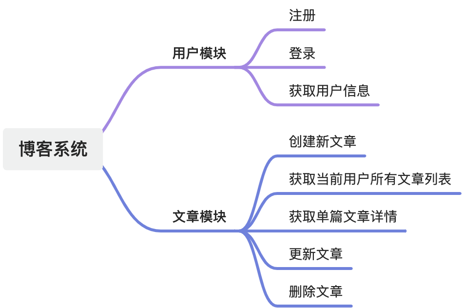

# Spring Boot 博客系统代码

带有基本用户认证的简单博客系统API，允许用户注册、登录，以及创建、阅读、更新和删除博客文章。

## 功能列表



## 技术栈

- Java 17
- Spring Boot 3.2.7
- MySQL 8.3.0
- Mybatis 3.0.3
- Mybatis Plus 3.5.3
- guava 32.1.2-jre
- mapstruct 1.6.0.Beta1
- knife4j 4.4.0
- lombok 1.18.32
- validation 3.2.1
- hutool 5.8.8
- sa-token 1.38.0

## 快速开始

1. 克隆项目到本地
2. 使用`sql`目录下的`init.sql`文件初始化数据库
3. 修改`application.yml`中的数据库配置
4. 运行项目

## 上线部署

1. 配置`application.yml`中的数据库配置
2. 使用 `mvn package` 打包项目
3. 上传 jar 包和 Dockerfile 到服务器
4. 构建 Docker 镜像
```bash
docker build -t post-demo-0.0.1 .
```
5. 运行 Docker 容器
```bash
docker run -p 9527:9527 -d post-demo-0.0.1
```